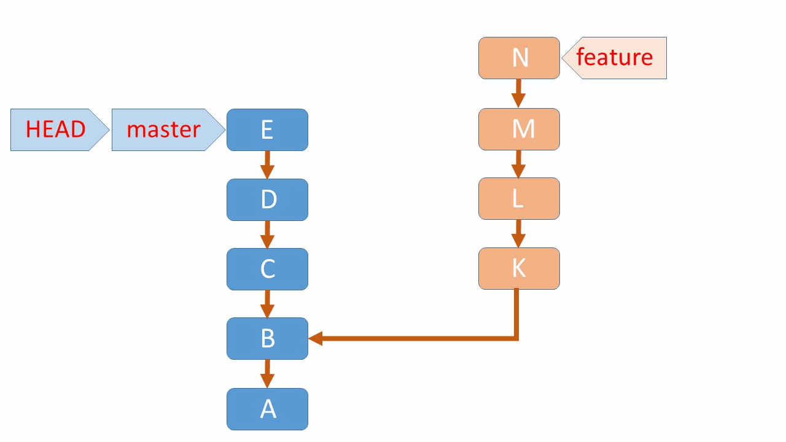
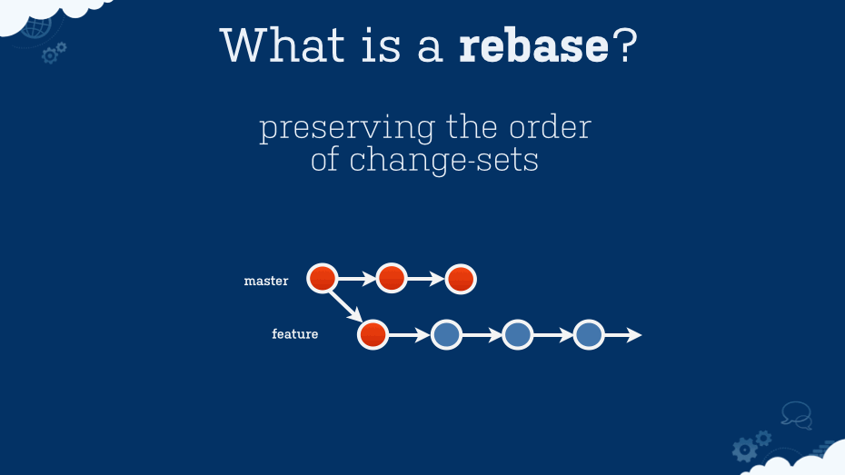

# <span style="color:#ADD8E6"> Lab4 - Advanced Git Usage </span>

<div align="right"> </div>

## <span style="color:#ADD8E6">Table of Contents </span>

- [Description](#desc)
- [Prerequisites](#pre)
- [Background](#bg)
- [Git Workflow](#gitflow)
- [Cherry-Picking a Commit](#cherry-picking-a-commit)
- [Cherry-Picking from a Remote Branch](#cherry-picking-from-a-remote-branch)
- [Rebasing a Branch](#rebasing-a-branch)
- [Rebasing with a Remote Branch](#rebasing-with-a-remote-branch)
- [Resources](#resources)

<a id="desc"></a>

## <span style="color:#ADD8E6"> Description </span>
This lab focuses on advanced Git functionalities including branching strategies, rebasing, cherry-picking, and handling merge conflicts. You'll learn how to efficiently manage and navigate complex git histories, maintain a clean and functional codebase, and utilize Git workflows like Git Flow for collaborative software development.


<a id="pre"></a>

## <span style="color:#ADD8E6"> Prerequisites </span>

Before starting this lab, you should have:

- Basic understanding of Git commands (`git add`, `git commit`, `git push`, `git pull`)
- Git installed on your machine
- Access to a Git repository (e.g., GitHub, GitLab) where you can practice these concepts

<a id="bg"></a>
## Background

**Git Flow** is a branching model that defines a strict branching structure designed around project releases. Key concepts include:

- The `master` branch stores the official release history.
- The `develop` branch serves as an integration branch for features.
- **Feature branches** are used to develop new features and are merged back into the `develop` branch.
- **Releases** are based on the state of the `develop` branch. Once ready, `develop` is merged into `master` and tagged with a release number.
- **Hotfixes** branches are created from `master` to quickly address issues in production releases.

- Modifications to the codebase are represented as **commit** objects.
- The git history is an immutable linked list of commits.
- Feature branches are merged into develop.
- Once develop has been tested, develop is merged into master.

- If there are issues with a feature, we can revert the feature branch in develop.
- If there are issues with a release, we can revert the merge commit in master.

<a id="gitflow"></a>

## Git Workflow

Here's a git flow diagram of "merge"


For this lab, pull requests would have the diagram of "merge"

For branching, we draw an arrow out of the commit from the branch that we are branching off of, resulting in two separate streams.

You can make a git workflow diagram using software such as: https://www.eraser.io/use-case/git-diagram

You can also practice and get familiar using a simulator called learn **git branching**: https://learngitbranching.js.org


<a id="cherry-picking-a-commit"></a>
## Cherry-Picking a Commit

Cherry-picking allows you to apply changes from specific commits from one branch to another.




### Steps:

1. **Find the Commit Hash**: Identify the commit you want to apply.

    ```bash
    git log --oneline
    ```

2. **Switch to the Target Branch**: Move to the branch where you want the changes.

    ```bash
    git checkout targetBranch
    ```

3. **Cherry-Pick the Commit**: Apply the commit.

    ```bash
    git cherry-pick <commit-hash>
    ```

4. **Resolve Conflicts**: If there are conflicts, resolve them, then continue the cherry-pick.

    ```bash
    git add .
    git cherry-pick --continue
    ```

    To abort the operation:

    ```bash
    git cherry-pick --abort
    ```


<a id="cherry-picking-from-a-remote-branch"></a>
## Cherry-Picking from a Remote Branch

To cherry-pick a commit from a remote branch, you first need to make sure your local repository is aware of the remote branch's state.

### Steps:

1. **Fetch Remote Changes**: Update your local repo's information about remote branches.

    ```bash
    git fetch origin
    ```

2. **Cherry-Pick the Commit**: Using the commit hash from the remote branch, apply it to your current branch.

    ```bash
    git cherry-pick <commit-hash-from-remote-branch>
    ```

3. **Handle Conflicts**: Similar to local cherry-picking, resolve any conflicts and finalize the cherry-pick.

Remember, when working with remote branches, especially in a team environment, it's crucial to communicate your changes to avoid conflicts and ensure a smooth workflow.


<a id="rebasing-a-branch"></a>
## Rebasing a Branch

Rebasing updates your branch with changes from another branch, typically used to integrate the latest changes from the main branch into your feature branch.



### Steps:

1. **Update the Base Branch**: Ensure the branch you're rebasing onto is up-to-date.

    ```bash
    git checkout main
    git pull
    ```

2. **Checkout Your Branch**: Switch to your branch.

    ```bash
    git checkout yourBranch
    ```

3. **Rebase onto the Base Branch**: Start rebasing.

    ```bash
    git rebase main
    ```

4. **Resolve Conflicts**: Fix any conflicts and continue the rebase.

    ```bash
    git add <file>
    git rebase --continue
    ```

    To stop the rebase:

    ```bash
    git rebase --abort
    ```


<a id="rebasing-with-a-remote-branch"></a>
## Rebasing with a Remote Branch

Rebasing your local branch with changes from a remote branch helps to maintain a linear project history and simplify future merges. This process is particularly useful for incorporating the latest updates from the main or development branch into your feature branch.

### Steps:

1. **Fetch the Latest Changes**: Before rebasing, you need to ensure your local copy of the remote branch is up-to-date.

    ```bash
    git fetch origin
    ```

    This command updates your local repository's knowledge of the remote branch without merging any changes into your current branch.

2. **Checkout Your Feature Branch**: Make sure you're working on your local branch that you want to rebase onto the remote branch.

    ```bash
    git checkout featureBranch
    ```

    Replace `featureBranch` with the name of your local branch.

3. **Rebase onto the Remote Branch**: Perform the rebase operation using the updated remote branch reference.

    ```bash
    git rebase origin/main
    ```

    Replace `main` with the name of the remote branch you're rebasing onto. This command re-applies your local branch's commits on top of the latest commits from the remote branch.

4. **Resolve Any Conflicts**: If the rebase process encounters conflicts, it will pause, and you'll need to resolve these conflicts manually. After resolving a conflict in a file:

    ```bash
    git add <resolved-file>
    git rebase --continue
    ```

    Repeat this process until all conflicts are resolved. If at any point you decide you want to stop the rebase and return to the original state:

    ```bash
    git rebase --abort
    ```

5. **Push Your Changes**: After successfully rebasing, you might need to force push your changes to the remote repository, especially if you've already pushed your branch before rebasing.

    ```bash
    git push origin featureBranch --force
    ```

    **Caution**: Be careful with `git push --force` as it can overwrite history on the remote. It's recommended to use it only on branches where you are the sole contributor or after coordinating with your team.


<a id="resources"></a>
## Resources

[Git cherry pick](https://www.atlassian.com/git/tutorials/cherry-pick#:~:text=Cherry%20picking%20is%20the%20act,to%20where%20it%20should%20belong.) <br/>
[Merging vs rebasing](https://www.atlassian.com/git/tutorials/merging-vs-rebasing#the-golden-rule-of-rebasing) <br/>
[Gitflow workflow](https://www.atlassian.com/git/tutorials/comparing-workflows/gitflow-workflow) <br/>

